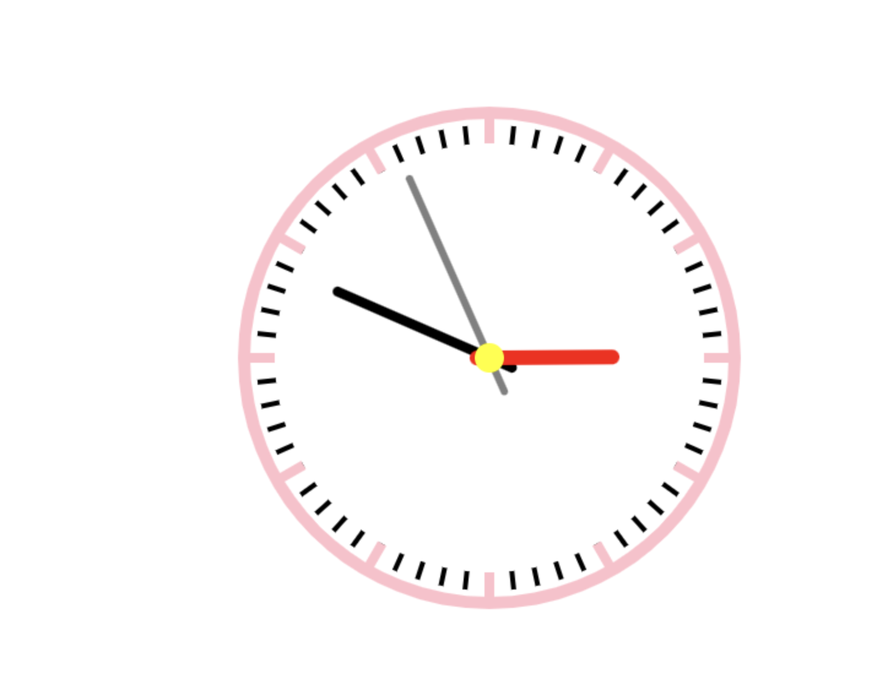

## 多看美女可以长寿 保持心情愉悦


###  这是画好的效果图 适合初学canvas



html部分

``` html
<canvas id="clock" width="800px" height="600px"></canvas>

```


js 部分

```js
 // 画 时钟
        function drawClock() {

            // 创建画笔
            let ctx = document.getElementById('clock').getContext('2d')
            ctx.clearRect(0, 0, 800, 600)
            ctx.save()
            // 移动原点到画布中心
            ctx.translate(400, 300)
            // 校正秒针
            ctx.rotate(-2 * Math.PI / 4)
            ctx.save()
            // 绘制表盘圆，每次进行绘制的时候，都要进行路径的开始和结束
            ctx.beginPath()
            ctx.arc(0, 0, 200, 0, 2*Math.PI)
            ctx.strokeStyle = 'pink'
            ctx.lineWidth = 10
            ctx.stroke()
            // 结束本次绘制
            ctx.closePath()
            // 绘制完毕后对画笔进行重置和储存
            ctx.restore()
            ctx.save()
            // 分针刻度绘制: 使用 for 循环对绘制的分针刻度绕圆心进行旋转复制
            for(let i = 0; i < 60; i++) {
                ctx.rotate(Math.PI/30)
                ctx.beginPath() // 开始绘制
                ctx.moveTo(175, 0) // 线段的起点
                ctx.lineTo(190, 0) // 线段经过的点
                ctx.strokeStyle = 'black'
                ctx.lineWidth = 4
                ctx.stroke()
                ctx.closePath() // 结束绘制
            }
            ctx.restore()
            
            ctx.save()
            // 时针刻度的绘制
            for(let j = 0; j < 12; j++) {
                ctx.rotate(Math.PI/6)
                ctx.beginPath()
                ctx.moveTo(175, 0)
                ctx.lineTo(200, 0)
                ctx.strokeStyle = 'pink'
                ctx.lineWidth = 8
                ctx.stroke()
                ctx.closePath() // 结束绘制
            }
            ctx.restore()
            ctx.save()
            // 创建获取时间
            let nowTime = new Date()
            let hour = nowTime.getHours()
            let minute = nowTime.getMinutes()
            let second = nowTime.getSeconds()
            hour = hour > 12 ? hour - 12 : hour
            
            console.log(hour, '时', minute, '分',  second, '秒')
            
            // 秒针的绘制
            ctx.beginPath()
            // 此处旋转带上second变量，每次刷新后就可以实现秒针的动态走动
            ctx.rotate(2 * Math.PI/60*second)
            ctx.beginPath()
            ctx.moveTo(-30, 0)
            ctx.lineTo(160, 0)
            ctx.strokeStyle = 'grey'
            ctx.lineWidth = 6
            ctx.lineCap = 'round'
            ctx.stroke()
            ctx.closePath()
            ctx.restore()
            ctx.save()

            // 分针的绘制
            ctx.beginPath()
            ctx.rotate(2 * Math.PI/60*minute + 2 * Math.PI/3600*second)
            ctx.beginPath()
            ctx.moveTo(-20, 0)
            ctx.lineTo(135, 0)
            ctx.strokeStyle = 'black'
            ctx.lineWidth = 8
            ctx.lineCap = 'round'
            ctx.stroke()
            ctx.closePath()
            ctx.restore()
            ctx.save()

            // 时针的绘制
            ctx.beginPath()
            ctx.rotate(2 * Math.PI / 12 * hour + 2 * Math.PI / 720 * minute + 2 * Math.PI / 3600 * second);
            ctx.beginPath()
            ctx.moveTo(-10, 0)
            ctx.lineTo(100, 0)
            ctx.strokeStyle = 'red'
            ctx.lineWidth = 12
            ctx.lineCap = 'round'
            ctx.stroke()
            ctx.closePath()
            ctx.restore()
            ctx.save()

            // 给圆的中心加个圈
            ctx.beginPath()
            ctx.arc(0, 0, 12, 0, 2*Math.PI)
            ctx.fillStyle = 'yellow'
            ctx.fill()
            ctx.closePath()
            ctx.restore()
            ctx.restore()
        }
        setInterval(() => {
            drawClock()
        }, 1000)

```
canvas 的作用非常强大 等着你慢慢挖掘

