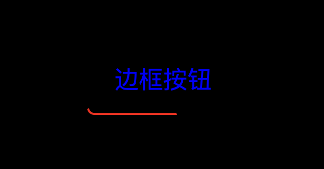
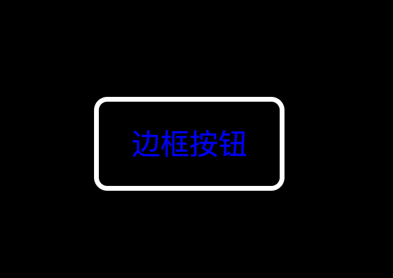
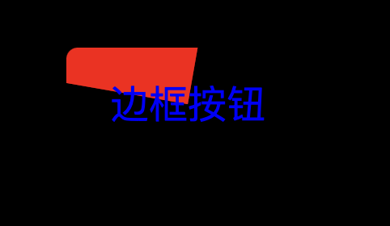

## 多看美女可以长寿 保持心情愉悦


### 这是效果图 这个红色线条是按钮点击之后发起请求的一个动态的运动效果



```js
  分析： 先做一个按钮 设置伪元素在坐标原点进行旋转 使用 z-index 和 overflow 来隐藏多余的部分
```

html 部分

```html
<div id="button">边框按钮</div>
```

css 部分

```css
body,
html {
  background-color: #000;
  height: 100%;
  display: flex;
  justify-content: center;
  align-items: center;
}
#button {
  width: 150px;
  height: 70px;
  overflow: hidden;
  text-align: center;
  line-height: 70px;
  color: blue;
  font-size: 24px;
  background-color: #000;
  border: none;
  outline: none;
  z-index: 1;
  border-radius: 7px;
  position: relative;
}
```



```js
实现最基本的按钮效果; 实现之后取消 outline 属性 白色部分就是进度条的轨迹
```

```css
#button {
  width: 150px;
  height: 70px;
  /* overflow: hidden; */
  text-align: center;
  line-height: 70px;
  color: blue;
  font-size: 24px;
  background-color: #000;
  border: none;
  outline: none;
  z-index: 1;
  border-radius: 7px;
  /* outline: 4px solid #fff; */
  position: relative;
}
#button::before {
  content: "";
  position: absolute;
  background-color: red;
  width: 200%;
  height: 200%;
  z-index: -2;
  left: 50%;
  top: 50%;
  transform-origin: 0 0;
  animation: move 3s infinite linear;
}

#button::after {
  content: "";
  position: absolute;
  background-color: #000;
  width: calc(100% - 4px);
  height: calc(100% - 4px);
  top: 2px;
  left: 2px;
  border-radius: 5px;
  z-index: -1;
}

@keyframes move {
  to {
    transform: rotate(1turn);
  }
}
```


其实进度条就是一个在元素里面旋转的伪元素 遮挡它在按钮内部的区域 留出边框的一个空间做它的轨迹
 给按钮添加上 overflow：hidden 就实现效果了
