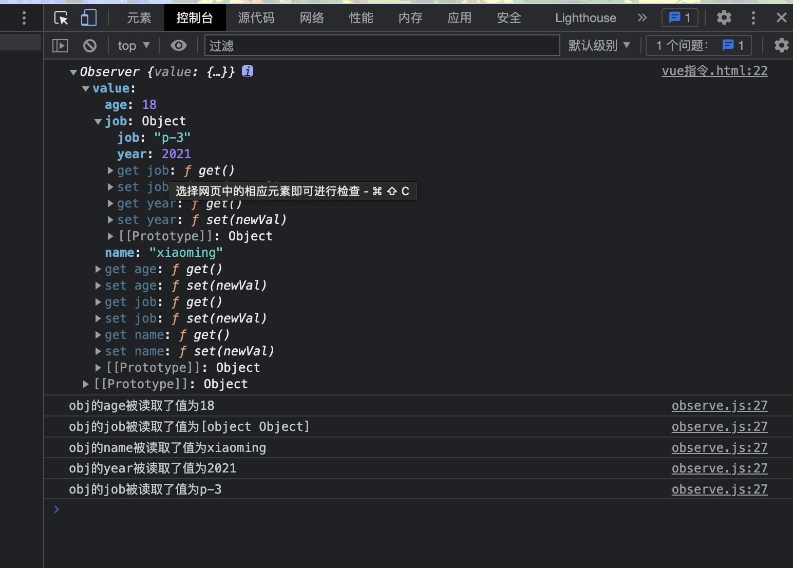

## 多看美女可以长寿 保持心情愉悦


# 检测对象的每一个属性的变化

```js
// 新建一个文件夹 observer.js
export class Observer {
  constructor(value) {
    this.value = value;
    if (Array.isArray()) {
      console.log("走数组的逻辑");
    } else {
      // 走对象的逻辑
      this.walk(value);
    }
  }
  walk(obj) {
    // todo: 给对象的每一个属性添加监听
    let keys = Object.keys(obj);
    for (let i = 0, len = keys.length; i < len; i++) {
      this.defineFn(obj, keys[i]);
    }
  }
  defineFn(obj, key, val) {
    if (arguments.length == 2) {
      val = obj[key]; // 当前项的值
    }
    if (typeof val === "object") {
      new Observer(val); // 对象的属性可能还是对象 递归一遍
    }
    Object.defineProperty(obj, key, {
      get() {
        console.log(`obj的${key}被读取了值为${val}`);
        return val;
      },
      set(newVal) {
        console.log(`obj的${key}属性被修改了，现在是${val}`);
        val = newVal;
      },
    });
  }
}
```

```js
// 通过模块化规范引入 Observer 使用
import { Observer } from "./observe.js";
let obj = new Observer({
  name: "xiaoming",
  age: 18,
  job: {
    year: 2021,
    job: "p-3",
  },
});
console.log(obj);
```



简单的效果已经实现了 当然还不完全 还要对数据为 null、undefined 等情况做处理等等
